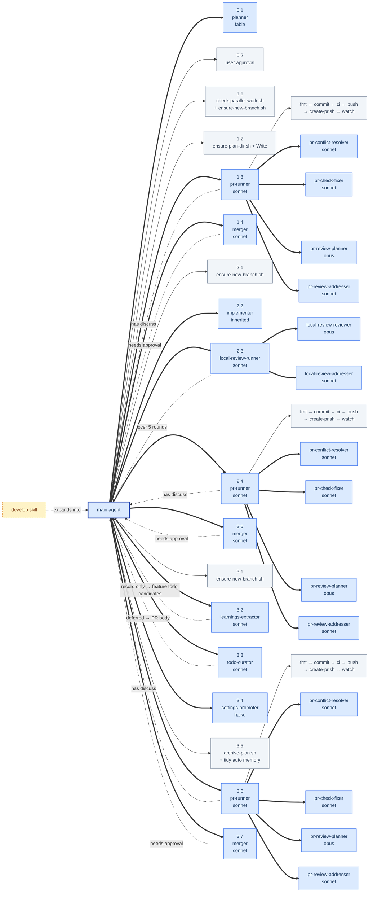
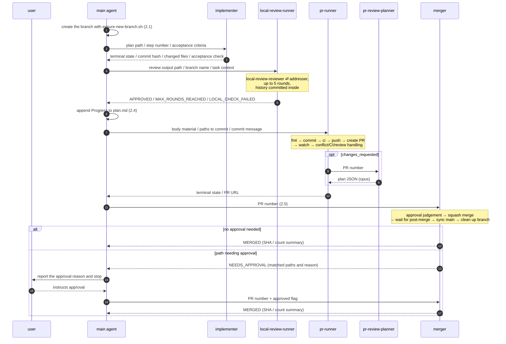
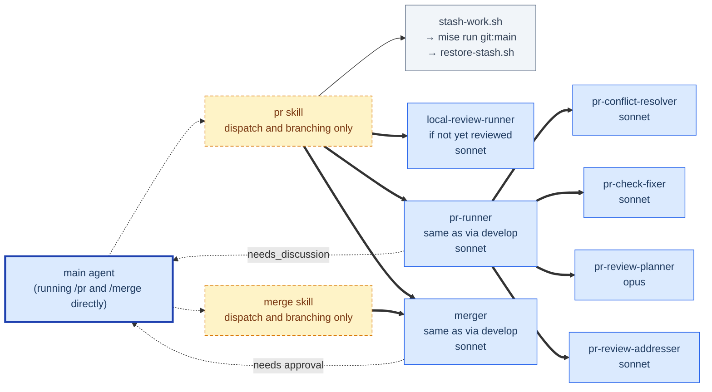

# Develop Skill

A skill that drives everything from planning through PR merge and archiving as
one continuous chain of subagents. The main agent sticks to orchestration and
never reads code or diffs directly.

See [SKILL.md](./SKILL.md) for the detailed procedure.

## The three kinds of actor

Get this distinction straight before reading the diagrams.

| Kind                | What it is                                            | context             | How it is drawn             |
| ------------------- | ----------------------------------------------------- | ------------------- | --------------------------- |
| **main agent**      | The session that expanded the develop skill            | shared with the user | blue, thick border / solid  |
| **subagent**        | A child conversation started with the `Agent` tool     | **independent**     | colored node / solid arrow  |
| **skill**           | A macro expanded into the main session by the `Skill` tool | shared with the main agent | dashed node / dashed arrow |

A subagent has an independent context, so the only contact it has with the main
agent is the prompt it was given and the text it returns. A skill is expanded
into the main session as-is, so an `Agent` call inside a skill behaves as if the
main agent itself made it.

A subagent **can start further subagents** (by default down to 3 levels below
main; configurable with `CLAUDE_CODE_MAX_SUBAGENT_SPAWN_DEPTH`). But **that
default of 3 is a value fetched from a remote feature gate**, and it can change
from the server side even with the same Claude Code version. That is why
`CLAUDE_CODE_MAX_SUBAGENT_SPAWN_DEPTH` is pinned in the `env` of
`.claude/settings.json`. An agent that declares `tools` explicitly without
including `Agent` is a leaf. Omit the `tools` key entirely and the environment
hands it the whole tool pool, `Agent` included — so the agents you want as
leaves are exactly the ones that need an explicit `tools` declaration.
`AskUserQuestion`, on the other hand, is stripped even if you list it in
`tools`, so **subagents cannot ask the user questions**. That is a real
constraint no setting can relax, and the "send discuss back to main" design
below comes from it.

## The whole flow



**This diagram shows the normal mode, with two or more steps.** With one step,
Phases 1–3 fold into Phase S (single-PR mode) and the PR and merge happen once.
See the phase list below for how the nodes map to S.1–S.7.

Legend:

| Color | Meaning | context |
| --- | --- | --- |
| Blue, **thick border** | **main agent** — the session running the expanded `develop` skill | shared with the user |
| Blue | **subagent** — a child conversation started with the `Agent` tool | **independent** |
| Yellow, dashed | **skill** — not an actor, but text read by the agent it expands into | shared with that agent |
| Gray | **Operations the main agent performs itself**, and steps internal to an agent | — |

The `develop` skill itself is yellow and dashed, and the relationship where the
main agent expands and runs it sits at the root. The main agent is a kind of
agent too, so it keeps the blue family, distinguished by a thick border as the
only one that talks to the user directly.

`pr-runner` is used in four places: 1.3 / 2.4 / 3.6 / S.6. There is one agent
definition but four separate invocations, each with its own children, and the
diagram draws them independently per phase. `merger` (1.4 / 2.5 / 3.7 / S.7) is
likewise one definition invoked four times, but it is a leaf with no children.

## Phase list

Sub-phases are sized to **one agent / skill / script invocation**, so they map
one-to-one onto the nodes in the diagram above.

| Phase | What | What it starts |
| --- | --- | --- |
| **0** | **Planning** (no git operations; interrupting has zero side effects) | |
| 0.1 | Make the plan | `planner` (agent) |
| 0.2 | User approval | — (main + the user; go back to 0.1 if they want changes) |
| **1** | **Persisting the plan** (once) | |
| 1.1 | Branch prep | `check-parallel-work.sh` + `ensure-new-branch.sh` |
| 1.2 | Persist the plan | `ensure-plan-dir.sh` + `Write` (no commit) |
| 1.3 | Create and watch the plan PR | `pr-runner` (agent) |
| 1.4 | Merge | `merger` (agent) |
| **2** | **The step loop** (★repeat 2.1–2.5 per step) | |
| 2.1 | Branch prep | `ensure-new-branch.sh` |
| 2.2 | Implementation | `implementer` (agent) |
| 2.3 | Local review | `local-review-runner` (agent) + `local-review-reviewer` + `commit-review-history.sh` |
| 2.4 | Create and watch the PR | `pr-runner` (agent) |
| 2.5 | Merge | `merger` (agent) |
| **3** | **Wrap-up** (once) | |
| 3.1 | Chore branch prep | `ensure-new-branch.sh` |
| 3.2 | Extract learnings | `learnings-extractor` (agent) + main consolidates into the existing guides and saves follow-ups as the feature's todo candidates |
| 3.3 | Curate todo.md | `todo-curator` (agent) + main writes without consent (deferred judgements go to the PR body) |
| 3.4 | Promote settings | `settings-promoter` (agent) + `commit-settings.sh` |
| 3.5 | Archive the plan + tidy auto memory | `archive-plan.sh` + main |
| 3.6 | Create and watch the chore PR | `pr-runner` (agent) |
| 3.7 | Merge | `merger` (agent) |
| **S** | **Single-PR mode** (run instead of Phases 1–3 when there is one step) | |
| S.1 | Branch prep (= 1.1) | `check-parallel-work.sh` + `ensure-new-branch.sh` |
| S.2 | Persist the plan (= 1.2) | `ensure-plan-dir.sh` + `Write` (no commit) |
| S.3 | Implementation (= 2.2) | `implementer` (agent) |
| S.4 | Local review (= 2.3) | `local-review-runner` (agent) + `local-review-reviewer` + `commit-review-history.sh` |
| S.5 | Wrap-up (= 3.2–3.5) | `learnings-extractor` → `todo-curator` → `settings-promoter` + `commit-settings.sh` → append Progress → archive with a plain `mv` → tidy auto memory |
| S.6 | Create and watch the PR | `pr-runner` (agent) |
| S.7 | Merge | `merger` (agent) |

Only S.5's archiving differs in means from 3.5, using a plain `mv` instead of
`archive-plan.sh`. The plan directory is already tracked from the S.3
`implementer`'s commit, so `archive-plan.sh`'s `git mv` would not fail in
Phase S either. The reason to avoid it is that the script also commits and
pushes as it moves (which is correct for 3.5, an independent chore PR). Phase S
is designed so the S.6 `pr-runner` bundles it with learnings / todo / settings
into one commit, and pushing separately here would split that up. A plain `mv`
avoids an extra commit / push that exists only for archiving (pushes stay at
two — `commit-review-history.sh` in S.4 and `pr-runner` in S.6 — and commits
stay at four routes: S.3, S.4, `settings-promoter` in S.5, and S.6).

## Old → new phase mapping

Past plans and learnings under `docs/plans/` are written with the old numbers
(Phases 1–5). This table is for reading them.

| Old | New | What changed |
| --- | --- | --- |
| 1 Planning | 0.1 | Built-in `Plan` → the `planner` agent |
| 2 User approval | 0.2 | Folded a thin phase into a sub-phase |
| 3.1 Branch prep | 1.1 | `/main` was merged into `ensure-new-branch.sh` |
| 3.2 Start `plan-persister` | 1.2 | Agent removed (`plan-persister` is gone). `ensure-plan-dir.sh` + main's `Write` |
| 3.3 Record auto memory & commit | 1.2 / 1.3 | Recording is 1.2; the commit is `pr-runner` in 1.3 |
| (none) | 1.3 / 1.4 | **New.** A plan-only PR and waiting for its merge |
| 4.1 Implementation | 2.2 | |
| 4.2.1–4.2.4 Review cycle | 2.3 | Moved inside `local-review-runner` and disappeared from SKILL.md |
| 4.3 Commit the review results | 2.3 | `local-review-runner` calls `commit-review-history.sh` |
| 4.4.1 Append Progress | 2.4 | Main appends; `pr-runner` commits |
| 4.4.2 Compose the PR title and body | 2.4 | `pr-runner` reads the plan file and composes them |
| 4.4.3 `Skill(pr)` | 2.4 | Became a direct `pr-runner` agent invocation |
| 4.5 Wait for merge & sync main | 2.5 → 2.1 of the next loop | Branch creation moved to the head of the next loop |
| 5 steps 1-2 | 3.1 | |
| 5 step 3 learnings | 3.2 | The `learnings-extractor` agent |
| (none) | 3.3 | **New.** Curating todo.md with the `todo-curator` agent |
| 5 step 4 settings | 3.4 | The `settings-promoter` agent |
| 5 steps 5-6 archive / memory | 3.5 | |
| 5 step 7 chore PR | 3.6 | `Skill(pr)` → the `pr-runner` agent |
| (none) | 3.7 | **New.** Waiting for the chore PR to merge |
| 5 step 8 close the Issue | (removed) | Running todos through GitHub Issues was dropped entirely in favor of `todo.md` (see below) |

## The shared pattern: branch → work → PR → merge

**Phases 1–3 have exactly the same shape:**

```
Phase 0  plan → approval                                        ← no git operations
Phase 1  branch → persist                        → PR → merge
Phase 2  branch → implement → review             → PR → merge     ★N times
Phase 3  branch → learnings/settings/archive     → PR → merge
```

Only Phase 0 is an exception, and because its nature differs the reason is
clear: **Phase 0 has committed nothing yet, so interrupting it has no side
effects**. From Phase 1 on, git operations enter and branches and PRs come into
existence. That boundary shows up in the numbering.

Branch creation goes at the **head of each phase and each loop**. Cut the next
branch at the tail and Phase 1 ends up making the branch for Phase 2, crossing
responsibility boundaries. At the head, each one makes its own branch.

The merge at the tail belongs to the `merger` agent. A PR touching paths a
revert cannot undo when they break (`.claude/**`, `.github/**`, toolchain and
supply-chain configuration, and so on) comes back to the main agent as
`NEEDS_APPROVAL`, and that is the single point of dialogue across Phases 1–3 /
Phase S. `.md` is on the safe side regardless of directory, except under
`.claude` / `.agents` / `.codex`, so a docs-only PR never lands here. `merger`
also syncs main and cleans up the branch, which duplicates the sync built into
`ensure-new-branch.sh` at the head of the next loop — but both are idempotent
operations against `origin/main`, so there is no harm.

### Phase 1 makes a PR too

In the old scheme the plan.md commit **rode along in Step 1's PR**, which made
Phase 3's branch the same as Step 1's branch — a special-cased structure. Adding
1.3 (create the PR) and 1.4 (wait for the merge) gives it the same shape as
Phase 2, and:

- **The plan can be reviewed independently.** People can object to the plan
  before implementation starts
- **Step 1's PR becomes implementation only.** The old scheme mixed the plan.md
  diff into it
- Phase 1's branch stops being a special case

The cost is one more PR and one more merge. The PR only contains plan.md, so CI
is light. The 0.2 user approval and the PR review overlap somewhat, but it does
give automated and human reviewers a chance to look at the plan.

### Folding into one PR with single-PR mode (Phase S)

"Phase 1 makes a PR too" above assumes two or more steps, and **it does not pay
for a one-step plan**. For a single step's worth of change you go around the
queue — required checks, automated review, approver, post-merge — three times.
Waiting dominates the actual work, and two of the three PRs contain only plan.md
and the wrap-up, with almost nothing worth reviewing independently.

So when there is exactly one step, Phases 1–3 fold into Phase S and the queue is
traversed once. **Nothing is dropped from the work** — local review, extracting
learnings, curating todo, promoting settings, and archiving all happen inside
S.1–S.7; what is dropped is the PR boundaries and the merge waits.

Three risks are accepted:

1. **The diff added in S.5 and the settings promotion commit are not pushed
   until S.6.** The plan directory is in the S.3 `implementer`'s commit and is
   pushed to origin at S.4 time by `commit-review-history.sh`, together with the
   review history (S.4). What is not pushed is S.5's additional learnings
   extraction, `todo.md` curation, the Progress line in plan.md, the archive
   rename, and `settings-promoter`'s promotion commit (`commit-settings.sh` is
   designed not to push). If you interrupt, none of that can be resumed from
   another machine or another session (parallel-work detection on the same
   machine still works, via `check-parallel-work.sh` in S.1)
2. **plan.md / learnings / `todo.md` / `settings.json` are mixed into the review
   diff.** This is a return to the old scheme's "plan.md rides along in Step 1's
   PR", but with one step the noise is small
3. **A run with a settings diff always becomes `NEEDS_APPROVAL` because of
   `.claude/**`, and the implementation stops with it.** In normal mode only the
   chore PR stops and the implementation is already in. But approval only
   happens once, so the total does not get worse

There is no "exclusion rule to avoid Phase S" on the `planner` side. A change
that needs approval, such as one under `.claude/**`, can still fit in one step,
so needing approval is not avoidable in itself — the judgement is that since
that approval happens only once, it is accepted as risk 3 above. Plans whose
step-splitting rules already force multiple steps (for example, keeping
infrastructure changes and application code in separate PRs) split under those
existing rules anyway.

If you start out expecting one step and it does not fit, follow "When it turns
out not to fit in one step (demotion)" in SKILL.md: rewrite plan.md and drop
back to the old shape where it rides along in Step 1's PR. plan.md has not been
merged at that point, so rewriting it on the same branch and in the same PR is
all it takes — no extra PR.

### Issue integration was removed

There used to be a workflow that searched for related Issues in Phase 0, linked
them, wrote `Related: #N` into the step and chore PR bodies, and closed the
Issue at the end (3.8). Running todos through GitHub Issues was dropped
entirely, and unstarted work was consolidated into `todo.md`, so that workflow
is gone in full. Phase 3 ends at 3.7 (merge).

### Changes to the numbering scheme itself

- **The three-part structure shows up in the numbers.** "Once / repeated per
  step / once" maps onto Phases 1, 2, and 3, and the loop range coincides with
  the whole of Phase 2. In the old scheme Phases 4.1–4.5 were the repeated part,
  but you could not read that off the numbers
- **It fits in two levels.** The old `4.2.1`–`4.2.4` (review rounds) and
  `4.4.1`–`4.4.3` (the breakdown of PR creation) moved inside
  `local-review-runner` / `pr-runner` and disappeared from SKILL.md
- **The notation is consistent.** In the old scheme Phases 3 and 4 used dotted
  notation while Phase 5 alone was a `1.`–`8.` numbered list
- **The names match the contents.** The old Phase 3, "persisting the plan",
  included branch prep — a git operation — whereas the new scheme splits it into
  1.1 (branch prep) and 1.2 (persisting)

## Agent naming convention

`<parent prefix>-<role>`. Agents with no parent have no prefix. The role is
always in `-er` / `-or` form (an agent is a thing that does a job).

| agent | Role | Parent | model | Category |
| --- | --- | --- | --- | --- |
| `planner` | Makes the plan | — | **`fable`** | Top-level judgement |
| `implementer` | Implements | — | inherited | Implementation |
| `local-review-runner` | Runs the review loop | — | `sonnet` | Routine execution |
| `local-review-reviewer` | Raises feedback | `local-review-runner` | **`opus`** | Judgement that passes silently |
| `local-review-addresser` | Addresses feedback | `local-review-runner` | `sonnet` | Routine execution |
| `pr-runner` | Creates, watches, and branches on a PR | — | `sonnet` | Routine execution |
| `pr-conflict-resolver` | Merges main in and resolves conflicts | `pr-runner` | `sonnet` | Routine execution |
| `pr-check-fixer` | Reads failed check logs and fixes the code | `pr-runner` | `sonnet` | Routine execution |
| `pr-review-planner` | Decides how to handle review feedback | `pr-runner` | **`opus`** | Judgement that passes silently |
| `pr-review-addresser` | Applies that decision | `pr-runner` | `sonnet` | Routine execution |
| `merger` | Merges the PR and sees post-merge through | — | `sonnet` | Routine execution |
| `learnings-extractor` | Extracts reusable knowledge | — | `sonnet` | Routine execution |
| `todo-curator` | Proposes deletions and additions for todo.md | — | `sonnet` | Routine execution |
| `settings-promoter` | Promotes settings | — | `haiku` | Mechanical |

"Parent" is the naming-convention parent (where the prefix comes from); `—`
means it is dispatched directly from a skill such as develop or pr. "Category"
is which entry in "Choosing a model" below it falls under, and maps one-to-one
onto the model.

Choosing a model:

- **`fable`** = the top-tier, highest-priced model. The hardest judgement: its
  output governs every subsequent step, it is called rarely, and its input is
  small. `planner` only
- **`opus`** = **judgement where mistakes pass through silently**. Nothing
  downstream gates it — no user gate, no automatic verification — or only
  partially. Two of them: `local-review-reviewer` (nobody catches what it
  misses) and `pr-review-planner` (there is a partial gate, but a
  misclassification between `fix` and `reject` is not caught, and a `reject`
  goes out publicly as a reply on GitHub)
- **`sonnet`** = following a fixed procedure or decision and branching on the
  result (the `*-addresser`s applying a decision, the runners watching and
  delegating to children, `merger` branching on script exit codes), plus
  `pr-conflict-resolver` / `pr-check-fixer` whose failures surface in CI, plus
  `learnings-extractor` / `todo-curator` which only return proposals the user
  ultimately accepts or rejects
- **`haiku`** = almost no judgement at all (`settings-promoter` only runs a
  script and `Write`)
- **inherited** (the session model) = implementation, where quality cannot drop.
  `implementer` only

**The runners get away with cheap models because the real work went to their
children.** Pure orchestration does not need an expensive model — a side benefit
of splitting into agents.

All models are pinned in the agents' frontmatter. No skill specifies
`Agent(model: ...)` anywhere.

Having two `addresser`s is correct. Both have the same role — address the
feedback — and the only difference is **who reviews**: in `local-review` an
agent reviews, in `pr-review` GitHub (automated review / humans) reviews. That
shows up as the presence or absence of a `reviewer`.

The main agent starts exactly **eight** agents directly: planner, implementer,
local-review-runner, pr-runner, merger, learnings-extractor, todo-curator, and
settings-promoter. It uses none of the built-in agents (`Plan` / `Explore` /
`general-purpose`).

## `pr-runner` does not read code

Conflict resolution and CI failure fixing went to child agents, so what is left
in `pr-runner` is **create the PR → watch → branch**.

```
pr-runner
├── pr-conflict-resolver   (on a conflict)
├── pr-check-fixer         (on check_failed / local CI failure)
├── pr-review-planner      (on changes_requested)
└── pr-review-addresser    (once the decision is made)
```

Why split this out when implementer's CI self-repair loop is not split out:

- implementer's `mise run ci` runs **once, at the end**, and fixing it ends it
- `pr-runner` can have CI fail **many times inside its watch loop**. Each
  failure piles up logs (thousands of lines) and fills the context of an agent
  that needs to keep watching. Hand it to a child and it resets per fix
- The roles differ too. `pr-runner` is an orchestrator that watches and
  branches; conflict resolution and CI fixing are real work that writes code

The result is that the property develop's main agent has — never reading code or
diffs — is reproduced one level down in `pr-runner`.

The `pr-*` children do not get `Agent`. main (depth 0) → `pr-runner` (depth 1) →
`pr-*` (depth 2) already reaches "main → agent → agent, two layers", so no
grandchildren from there.

## The round trips inside a step (Phase 2 in detail)

What the main agent and the subagents hand each other within one step.



The reviewer and `local-review-addresser` never see each other's return values.
Their only handoff point is
`docs/plans/review-history/{branch-name}/review-{YYYYMMDD-HHmm}.md`, and it is
`local-review-runner` that reads the `STATUS:` line and branches. Neither the
per-round `STATUS:` nor the content of the feedback reaches the main agent.

Because the handoff is confined to a file, swapping out just the reviewer role
does not change this structure.

## Scripts on the main agent's side

The ones the main agent invokes directly. Loops and conditionals are shut inside
the scripts to avoid compound commands that trigger permission prompts.

| Script                   | Phase                                        | Role                                                            |
| ------------------------ | -------------------------------------------- | --------------------------------------------------------------- |
| `check-parallel-work.sh` | head of 1.1 / head of S.1                    | Are there traces of the same work in another worktree / origin / a PR (read-only) |
| `ensure-new-branch.sh`   | 1.1 / 2.1 / 3.1 / S.1                        | Sync main + validate kebab-case + check local/origin collisions + create the branch |
| `ensure-plan-dir.sh`     | 1.2 / S.2                                    | Check for a duplicate dated plan directory + create it            |
| `archive-plan.sh`        | 3.5 only (Phase S uses a plain `mv`)         | Move the plan folder under `_archived/` and commit+push           |

The remaining scripts are called by agents: `commit-review-history.sh` (and
`commit-push.sh` inside it) by `local-review-runner`, `commit-settings.sh` by
`settings-promoter`, and `create-pr.sh` / `wait-pr-actionable.sh` /
`pr-status.sh` and friends by `pr-runner` and below.

`ensure-new-branch.sh` is **always called with the Bash tool's
`dangerouslyDisableSandbox: true`**. When the diff against `origin/main`
includes `.claude/`, `git checkout` fails with
`unable to unlink old '.claude/...'` yet returns exit 0 (measured), so the only
way to notice is the script's after-the-fact check — and by then manual recovery
is needed.

`commit-push.sh` / `archive-plan.sh` / `commit-review-history.sh` are likewise
**always called with `dangerouslyDisableSandbox: true`**. All three run
`git push -u` on a branch with no upstream, then verify with `ensure_upstream`
in `_lib.sh` that the upstream was actually set. Setting an upstream writes to
the shared `.git/config` (the main repository's `.git/config`, shared even from
a linked worktree), and under the sandbox that **always** fails with
`could not lock config file ...: Operation not permitted` (measured;
deterministic, not probabilistic). Adding the path to `allowWrite` in
`.claude/settings.json` does not lift it. `ensure_upstream` does not branch on
the cause and hard-fails on both lock contention and the sandbox, so calling it
under the sandbox fails every time.

## Design notes

### What was peeled off the main agent

An inventory of what the main agent used to end up reading, in order of impact:

| Subject | Old scheme | New scheme |
| --- | --- | --- |
| **The merged settings.json**<br/>(old 5.4) | main received `merge.js --self`'s stdout (the whole merged JSON, hundreds of lines) and wrote it with the Write tool | 3.4's `settings-promoter`. main only receives a count |
| **Sorting `learnings.md`**<br/>(old 5.3) | main read the whole thing and sorted it into reusable knowledge and feature-specific logs | 3.2's `learnings-extractor`. main receives a consolidation proposal for the existing guides plus record-only follow-ups, and saves the latter as the feature's todo candidates |
| **CI failure logs / conflict diffs**<br/>(old 4.4.3's `Skill(pr)`) | the `pr` skill expands into the main session, so the reader was the main agent itself | `pr-runner` and its children. Only a terminal state and a PR URL reach main |
| **Composing the PR title and body**<br/>(old 4.4.2) | main read the relevant step of `plan.md` and composed them | hand `pr-runner` the plan path and step number and let the agent read it |

Delegating settings.json has large secondary effects. But delegation alone — old
scheme (main relays) → new scheme (`settings-promoter` relays) — did not remove
the risk of "write broken JSON if you fail to copy stdout correctly". Only the
subject of the transcription changed, from main to `settings-promoter`; the
structure of copying `merge.js --self`'s stdout out with the `Write` tool
survived inside the agent, and `settings-promoter` did in fact write broken JSON
through that route. In response, `--write` was added to `merge.js` so the script
writes `.claude/settings.json` itself, removing the transcription route
entirely.

`todo-curator` and `learnings-extractor` have neither `Write` nor `Edit`, so
**the writing stays with main**. But **no user consent is taken**. The human
check against a wrong deletion or a wrong addition is not prior consent but
**the enumeration in the chore PR body (after the fact)** (a chore PR touching
only `todo.md` can merge as `*.md` without approval, but `todo.md` is governed by
a delete-the-whole-line convention, so git history retains what was completed
and it can be restored with `git revert` or by re-adding). The "record only"
part from `learnings-extractor` is not applied to its proposed target directly:
it is saved under `## Deferred issues (todo candidates)` in the feature's file
and lands in `todo.md` via `todo-curator`. Existing issues are merged, and the
outcome is written into the PR body. `todo-curator`'s deferred judgements are
recorded in the PR body. Creating or appending to `docs/learnings/` has ended;
reusable points are consolidated into the existing guides, and measurements and
history stay in the feature's `learnings.md` and go to the archive. The reason
the repository's top-level code-of-conduct file (`CLAUDE.md`) is not edited
automatically during wrap-up is to avoid letting sonnet's judgement alone bloat
a document that rides in every agent's context every session.

**What cannot be peeled off** (stays with main):

- The full text of `planner`'s output — it has to be shown to the user for
  approval
- Deciding the feature name and branch name — decided from information already
  in main, so no extra cost
- Updating auto memory (`MEMORY.md`) — outside git, and main's responsibility
- Git operations (branch creation / stash) and script invocations

### Bundle round trips between different roles

The criterion for bundling a loop into a subagent is not "there is a loop" but
**whether the two parties going back and forth have different roles**:

| Loop | Roles going back and forth | Value of separating | Verdict |
| --- | --- | --- | --- |
| local review | reviewer ⇄ addresser | Independent perspective. The implementer does not judge their own code | **bundle** |
| PR watching | pr ⇄ review handling | Same | **bundle** |
| implementer's CI fixing | implementer ⇄ implementer (same) | None. Whoever wrote it fixes it faster | **do not bundle** |

Split out a same-role self-repair loop and an agent that does not know what was
just written ends up fixing it from the failure log alone: slower, with no
independence gained. And implementer's context is discarded anyway, so no amount
of CI log reading reaches main — the context-protection goal is already met. For
the same reason `implementer` has no child agents (delegating exploration to
`Explore` sends nothing to main and only adds round trips).

Conditions for handing control back to main when bundled:

| Bundling subagent | Hands back to main when |
| --- | --- |
| `local-review-runner` | more than 5 rounds / `LOCAL_CHECK_FAILED` |
| `pr-runner` | `needs_discussion` / `closed` / `aborted` |
| `learnings-extractor` | always (it has no writing tools; main writes, without consent) |
| `todo-curator` | always (it has no writing tools; main writes, without consent) |

**How progress looks**: bundling the loop means the per-round `STATUS:` lines
stop appearing in main's conversation log, but the subagent panel shows **a live
tree of every level** (each row has a descendant count, and `Enter` opens that
agent's transcript where you can send extra instructions). If you want it in the
conversation log too, a
[`SubagentStop`](https://code.claude.com/docs/en/hooks) hook can print one line.
It fires for nested children as well.

### Concentrate commits in `pr-runner`

In the old scheme `commit-push.sh` ran `mise run fmt` → `mise run ci` before
pushing, but **what to do on failure was never defined in SKILL.md**. The caller
ended up reading CI logs and fixing them — the same contamination as the `pr`
skill's conflict / CI fixing, arriving by a different route. And because the
`pr` skill also had a "Run local CI", **the full CI ran twice**.

Moving the commit itself into `pr-runner` solves both:

```
old  ≈1.2  Write → commit-push.sh (fmt + full CI + commit + push)
     ≈1.3  pr skill (local CI → create PR)              ← second time

new  1.2   ensure-plan-dir.sh + Write (no commit)
     1.3   pr-runner does fmt → commit → full CI → push → create PR
```

- **CI runs once**
- **CI failure handling is concentrated in one place, `pr-runner`.** It has
  `pr-check-fixer`, so a local CI failure can go there too
- The main agent and `local-review-runner` never read CI logs

The cost is that pushing now happens at PR creation, so **interrupting midway
leaves no commit behind** (the old scheme had pushed at persist time). The
review history alone would be lost if it stayed uncommitted, so
`local-review-runner` uses `commit-review-history.sh` as an exception, whether
it exits on APPROVED or on more than 5 rounds.

### The `main` skill (removed) was merged into `ensure-new-branch.sh`

The old scheme called `/main` (a skill) in three places, and each was
immediately followed by `ensure-new-branch.sh` — always the same pattern: **go
back to main and update, then cut a new branch**. Nothing inside develop called
`/main` on its own.

Merging the main sync into `ensure-new-branch.sh` got it down to one call. After
that, removing Issue integration removed 3.8 as well, and develop no longer uses
any skill (other than `develop` itself). Merging does not make the sandbox
unlink problem go away, so calling it with `dangerouslyDisableSandbox: true` is
as mandatory as it was in the `/main` days (measured; see this plan's learnings
under `docs/plans/_archived/`).

### The built-in `Plan` was replaced with `planner`

Built-in agents (`Plan` / `Explore` / `general-purpose`) cannot have definition
files, so **you cannot pin `model` / `tools` in frontmatter and cannot put
project conventions into the system prompt**. The old scheme worked around this
with `Agent(model: "fable")` on the skill side.

The cost of not being able to inject conventions was pushed onto
`plan-persister` (removed). For instance:

> Each step describes **what to implement**, in units the user can review and
> merge. The archive move, the auto memory update, and closing the Issue happen
> in the wrap-up phase, so do not include them in a step here.

lived in `plan-persister`'s template, but **that is something the planner ought
to know**. `Plan` did not, so it was corrected downstream.

Replacing it with a custom `planner`:

- `model: fable` can be pinned in frontmatter, so the skill-side carve-out is no
  longer needed
- The plan.md template and this project's step-splitting rules can live in the
  system prompt, so the output is already in plan.md form
- Behavior no longer depends on the Claude Code version (determinism)

### The implementation-approach field in plan.md

The old template gave each step effectively two lines, leaving only "what to
build" and "when it is done", and **never how to implement it**. `planner`'s
output includes the files being changed and the trade-offs, but the template had
nowhere to put them, so they were dropped at persist time. And since
`implementer` has no design phase either, **nobody owned the implementation
design within a step**.

`planner`'s template has an implementation-approach field:

```markdown
- [ ] Step 1: add a workflow_definitions table
  - Done when: the migration runs and the seed loads
  - Implementation approach (as far as it is known; omit if unknown):
    - the schema follows the same naming convention as the existing workflow_instances
    - a unique constraint on (workflow_id, version)
```

**Spelling out "as far as it is known" is the point.** Writing down what you do
not know at planning time produces a false approach, and implementer is then
bound by it. The goal is to pass along the constraints you do know without
losing them, not to finish the design up front.

### Persisting the plan does not need an agent

Moving to `planner` removed the need to reformat, and `plan-persister`'s
(removed) process decomposed into two kinds:

| Old process | What | Where it went |
| --- | --- | --- |
| 0 | kebab-case validation | done by `ensure-new-branch.sh` |
| 1–4 | get the date / decide the directory / check for existing (both unarchived and `_archived`) / mkdir | **`ensure-plan-dir.sh`** (not one LLM judgement needed) |
| 5–6 | write out plan.md | the main agent's **`Write`** (`planner`'s output is already in plan.md form) |

**The added context cost is zero.** The full plan is already in main's context
because Phase 0 shows it to the user. The old scheme handed it back to
`plan-persister`, so writing it directly removes one round trip.

The structure where a main agent operation sits between "make the plan" and
"write it" does not change. User approval (subagents cannot have
`AskUserQuestion`) and branch creation (write the plan first and it gets swept
into `git stash --include-untracked`, a known incident route) stay where they
are. But that is **a reason for main to do the writing, not a reason to split
off an agent**.

## When the user runs `/pr` / `/merge` directly

Outside develop you still need branch prep and local review, so the `pr` skill
covers just those two steps and hands off to the same `pr-runner`. The merge
likewise goes to the same `pr-runner` first, and then the `merger` shared with
develop finishes the safety judgement, the merge, the post-merge workflow, the
main sync, and the branch cleanup. The `merge` skill is a thin wrapper around
the same `merger` that develop's 1.4 / 2.5 / 3.7 / S.7 call, preserving the
existing direct route.



Branch prep does not line up with develop's (`ensure-new-branch.sh`) because of
how `restore-stash.sh` is designed: it runs `git checkout -b` at the top, so if
`ensure-new-branch.sh` created the branch first it falls to exit 3 with "already
exists". So the `/pr` route calls `mise run git:main` directly (with
`dangerouslyDisableSandbox: true`), which only syncs main.

The `pr` skill expands into the main session, so an `Agent` call from it behaves
as the main agent's own. That is, **`pr-runner`'s depth is 1 on both routes**,
with the `pr-*` agents below it at depth 2. Interposing a skill does not add
depth. The same holds for the `merge` skill and `merger`.

The `/merge` route differs from the develop route in only three ways, all
confined to the caller's branching (the agent definition is shared). `/merge` is
a command a human types, and typing it is the approval, so it starts `merger`
with the approved flag from the very first dispatch (`merger` skips the approval
judgement and never returns `NEEDS_APPROVAL`). develop runs unattended, so it
starts without the flag and stops at `NEEDS_APPROVAL` on paths that need it.
Also, on `NOT_READY`, `/merge` points the user at `/pr <number>` and ends,
whereas develop re-runs `pr-runner` exactly once. And on `MERGED`, `/merge`
reports and ends there, whereas develop moves straight to the next Phase / Step
without stopping for the user.

### The `address-review` skill was merged into the `pr` skill

In `/pr`, `pr-runner` handles PR creation, CI fixing, conflict resolution, and
review handling; once it returns ready or already-merged, `merger` handles the
safety judgement and post-merge. The intermediate goal of "get it to ready",
kept when `/address-review` was merged in, is no longer `/pr`'s exit condition.
The difference between a new PR and an existing one is expressible as an
argument:

```
/pr           → branch prep → local review → pr-runner → merger
/pr 42        → pr-runner against existing PR 42 → merger
```

| skill | Status |
| --- | --- |
| `pr` | Stays. A thin wrapper that calls `pr-runner` (dispatch and branching only) |
| `address-review` (removed) | Merged into `/pr <number>` |
| `address-review-apply` (removed) | Became the `pr-review-addresser` agent |

**The exception clause on the code-of-conduct side (the general-purpose detour)
was removed too.** That clause was a detour so "the `address-review` skill could
pass plan JSON to the `address-review-apply` skill via a `general-purpose`
subagent", but both skills are gone and `pr-review-planner` →
`pr-review-addresser` is now a direct agent-to-agent handoff, so there is
nothing left to detour around.

develop calls `pr-runner` directly rather than going through the `pr` skill
(interposing the skill only puts the procedure text into main's context for no
gain). The `pr` skill stays as the **entry point** for a user typing `/pr`.

### `gh pr create` goes through a script

PR creation is shut inside `create-pr.sh`, and **the body is written to a file
with the `Write` tool** and passed via `gh pr create --body-file`.

```bash
bash .claude/skills/pr/scripts/create-pr.sh "title" tmp/pr-body.md
```

Why:

- **It fits in an allowlist.** With a dynamic body you either need a broad entry
  like `Bash(gh pr create:*)` or you get a prompt every time. With a script it
  closes down to `Bash(bash .claude/skills/pr/scripts/create-pr.sh:*)`
- **It avoids the ANSI-C quoting problem.** Some people write multi-line bodies
  as `-b $'## Overview\n- change 1'`, but the `$` makes it prone to catching on
  the permission analyzer. On top of that, "copying `\n` verbatim leaks a
  literal `\n` into the PR body" was an incident documented in the old develop
  SKILL.md, with signs it had actually been hit

The arguments contain neither `$` nor a newline, so a single allowlist entry
covers it.

## Operational note: using it with `/goal`

[`/goal`](https://code.claude.com/docs/en/goal) (v2.1.139+) sets a completion
condition and **keeps turns running until it is met**. After each turn a small,
fast model (Haiku by default) checks the condition, and if it does not hold it
starts the next turn without returning control to the user. It is really a
wrapper around a session-scoped prompt-based Stop hook.

**It cannot be built into a skill's design.** `/goal` is a slash command, not a
tool, so SKILL.md's procedure cannot set it. The user sets it on the session and
uses it alongside develop.

They go together well:

- The evaluator judges **only from what was shown in the conversation** (it
  calls no tools). develop's Reporting convention prints progress to the
  conversation at the end of each phase, so the evaluator can read it
- The exit condition is measurable (every step's PR merged, and the chore PR
  merged). Phase S has no chore PR for archiving, so that exit condition never
  holds; when using `/goal` with a Phase S develop, read it as "the single PR
  was merged"

**The thing to watch is merge approval.** The merge itself is done by `merger`
in 1.4 / 2.5 / 3.7 / S.7, so a PR that needs no approval (a plan PR touching
only `.md` at any level, a chore PR with nothing to promote, an implementation
PR with only ordinary code changes) will not stop under `/goal`. But a Phase S
PR is a single PR containing the implementation plus the plan and learnings, so
it is more likely to become `NEEDS_APPROVAL` depending on what it implements
(see S.6 in SKILL.md), and `/goal` stops more often than in normal mode. The
case that can spin is when `NEEDS_APPROVAL` comes back, where it reports the
approval reason in prose and stops. But that is not a stopping point where the
harness blocks the turn, the way `AskUserQuestion` does — a prose report merely
ends the turn, so if `/goal` keeps injecting continuations, there is technically
room for the main agent to "treat it as approved" and go on to re-dispatch with
the approved flag without waiting for the user's instruction. Whether it
actually stops depends on the main agent's restraint. Mitigations:

- Put a **cutoff clause** like `or stop after 20 turns` into the condition
  (officially recommended)
- Set the goal **per phase** ("until Step 3's PR is ready", for instance)
- If the approval requests are in the way, **loosen the approval judgement
  itself** (promote it to a safe pattern in `check-merge-approval.sh`). That is
  a change to the criteria rather than a skill-side workaround, so treat it as
  an agreement about what may be merged unattended
- Do not re-dispatch with the approved flag in response to a prose
  `NEEDS_APPROVAL` report without an explicit instruction from the user (watch
  this especially when using `/goal`)

`POST_MERGE_FAILED` / `POST_MERGE_TIMEOUT` are stopping points too. Rerunning a
failed apply or supplying a secret by hand needs human judgement, so they do not
advance automatically even in unattended operation.

Combined with
[auto mode](https://code.claude.com/docs/en/auto-mode-config), tool approval is
automated too and it can run effectively unattended. It is a different thing
from `/loop` (re-running on a time interval); develop's step loop is sequential,
so `/loop` does not suit it.
