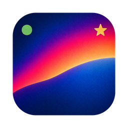

<a href="./README.md">English</a> | 日本語

# Riffle

撮った RAW をすばやく見ていき、残すものと捨てるものを決めるためのセレクトアプリです。

- RAW に埋め込まれた JPEG プレビューだけを読むので、数千枚のフォルダーでも、写真を切り替えるたびに待たされることがありません。
- スター、採用 / 不採用、カラーラベルは、Lightroom など XMP サイドカーを読むソフトや DxO PhotoLab が読めるサイドカーファイルに書き込みます。RAW ファイル自体には一切書き込みません。
- 現像も編集もしません。やることは「選ぶ」ことだけです。

対応カメラと形式は[対応状況](#対応状況)を参照してください。

## はじめに

### インストール

[Releases ページ](https://github.com/minodisk/riffle/releases)の最新リリースから、OS に合ったファイルをダウンロードします。

| OS | ファイル |
|----|------|
| macOS（Apple Silicon） | `Riffle_<version>_aarch64.dmg` |
| macOS（Intel） | `Riffle_<version>_x64.dmg` |
| Windows | `Riffle_<version>_x64-setup.exe` |
| Linux | `Riffle_<version>_amd64.AppImage` |

アプリは OS ベンダーの署名を受けていないため、初回起動時に一度だけ許可が必要です。

- **macOS**: `Riffle.app` を右クリック → 開く。
- **Windows**: SmartScreen の警告で「詳細情報」→「実行」。

以降のアップデートは起動時に自動でダウンロードされ、次回起動時に反映されます。その他のパッケージや詳細は [docs/usage.md](./docs/usage.md#installing)（英語）を参照してください。

### 最初の一歩

1. 初回起動時に表示されるダイアログで、使っている現像ソフト（Lightroom か DxO PhotoLab）を選びます。あとから設定で変更できます。
2. フォルダーをウィンドウにドロップします（`Cmd+O` / `Ctrl+O` でも開けます）。
3. `←` `→` で前後の写真に切り替え、`1`-`5` でスターを付け、`x` で不採用にします。
4. ピントが怪しいときは `z` で等倍表示にして、フォーカス位置を確認します。

判定はその場でサイドカーに保存されるので、保存操作はいりません。終わったら Lightroom など XMP サイドカーを読むソフトや DxO PhotoLab がそのまま取り込みます。

## 主な機能

- **フィルムストリップ**: 下端にサムネイルが並び、クリックで表示します。`Cmd+クリック` / `Ctrl+クリック` で 1 枚ずつ追加・解除、`Shift+クリック` や `Shift+←` / `Shift+→` で範囲選択でき、判定は選択中のすべてに適用されます。
- **等倍ピントチェック**: `z` でフォーカス位置を中心に等倍表示します。別の写真に切り替えてもズームは保たれます。
- **フォーカスマーク**: `f` で、AF 枠を記録するカメラではカメラが使った AF 枠と、そのフォーカス位置の十字を表示します。位置だけを記録するカメラでは十字のみ、AF 位置のないカメラやマニュアルフォーカスの写真では何も表示しません（[カメラが記録する情報](./docs/cameras.md)（英語））。
- **シャープネス表示**: 各サムネイルの横のバーで、連写のどのコマが最もシャープかがわかります。カメラが顔追尾を記録していればカメラの瞳 AF 枠で、そうでなければ AF 点の周辺で、カメラが AF 点を記録していなければ顔が見つかれば被写体の目で、それもなければ最もシャープな領域でスコアを取ります（[カメラが記録する情報](./docs/cameras.md)（英語））。
- **オフライン顔検出**: 顔と目は同梱の [YuNet](https://github.com/opencv/opencv_zoo/tree/main/models/face_detection_yunet) モデル（MIT ライセンス）で検出します。ローカルで動き、ネットワークにはアクセスしません。
- **連写**: 1 秒以内に撮られたコマはストリップ上で帯と枚数バッジでまとめられます。`ArrowUp` / `ArrowDown` で連写間を移動、`Alt+ArrowLeft` / `Alt+ArrowRight` で連写内のコマを順に移動して端で止まり、`Shift+x` で連写の残りを不採用にします。1 秒未満の撮影時刻を記録しないカメラでは秒単位でまとめます（[カメラが記録する情報](./docs/cameras.md)（英語））。
- **比較**: `v` で選択した 2〜4 枚を並べて表示するか、表示中の写真とその連写内で最もシャープなコマを並べます。コマをクリックすると、そのコマだけにスターや採用 / 不採用を付けられます。
- **不採用をゴミ箱へ移動**: `File > Move Rejected to Trash…` で不採用の写真をゴミ箱に移します。削除はしないので、元に戻せば判定も戻ります。

すべての機能と、キーの一覧は [docs/usage.md](./docs/usage.md)（英語）で説明しています（[キー](./docs/usage.md#keys)）。

## 他のソフトとの連携

判定は RAW の隣のサイドカーファイルに保存されます。形式は初回起動時に選び、あとから設定で変更できます。

- **Lightroom (XMP)**: `FOO.ARW` に対して `FOO.xmp` を作ります。Lightroom などが読む形式です。採用 / 不採用は `xmpDM:good` に、カラーラベルは Lightroom と同じく `photoshop:LabelColor` と `xmp:Label` の両方に書き込みます。`xmp:Label` に書く名前は色ごとに設定で変えられます。
- **PhotoLab (.dop)**: `FOO.ARW` に対して `FOO.ARW.dop` を作ります。採用 / 不採用もここに入ります。

他のソフトが作ったサイドカーはその場で編集します。スター、フラグ、ラベル以外（現像設定、キーワードなど）には手を触れません。

### Lightroom Classic

- Lightroom Classic は、写真を最初に読み込むときに Riffle が書いた XMP を読みます。
- 読み込み後は、Riffle が変更したサイドカーを再読み込みしません（再起動しても同じです）。フォルダーを右クリックして `Synchronize Folder...` を選び、`Scan for metadata updates` にチェックを入れて `Synchronize` をクリックしてください。
- Lightroom Classic はデフォルトでは XMP を書き出しません。`Ctrl+S`（`Metadata > Save Metadata to File`）で選択中の写真に書き出すか、`Catalog Settings > Metadata > Automatically write changes into XMP` をオンにしてください。
- カラーラベルは Lightroom Classic のカラーラベルセット（`Metadata > Color Label Set > Edit...`）と名前で照合されます。セットのラベル名を `Red`、`Yellow`、`Green`、`Blue`、`Purple` に変えるか、Riffle の設定でラベル名をセットの名前に合わせてください（日本語版のデフォルトセット用のプリセットを用意しています）。

## 対応状況

チェックのないものはまだ検証できていません。使ってみた結果の報告は大歓迎です。

### OS

- macOS
  - [x] 26（Apple Silicon）
- Windows
  - [x] 11
- Linux
  - [x] Ubuntu

動いた場合は Discussions の[OS 動作報告スレッド](https://github.com/minodisk/riffle/discussions/286)に投稿してください。動かない場合は[OS 用の issue テンプレート](https://github.com/minodisk/riffle/issues/new?template=os.yml)から issue を立ててください。

### RAW 形式とカメラ

- ARW
  - [x] Sony α7 V
- DNG
  - [x] Leica M11-P
  - [x] SIGMA BF
  - [x] SIGMA fp L

カメラごとに記録している情報と、それによって変わる機能は [docs/cameras.md](./docs/cameras.md)（英語）にまとめています。

リストにないカメラで動いた場合は Discussions の[カメラ動作報告スレッド](https://github.com/minodisk/riffle/discussions/287)に投稿してください。動かない場合は[カメラ用の issue テンプレート](https://github.com/minodisk/riffle/issues/new?template=camera.yml)から issue を立ててください。調査にはサンプルファイルが必要なので、添付（またはリンク）をお願いします。1 枚で十分ですが、できれば横位置と縦位置の 2 枚があると、回転とフォーカスマークも確認できます。

### サイドカー形式とソフト

- XMP
  - [ ] Adobe Lightroom（Windows、Lightroom Classic ではないもの）
  - [ ] Adobe Lightroom Classic（Windows、日本語 UI）
  - [ ] Capture One
- DOP
  - [x] DxO PhotoLab 10

Riffle で付けたスター、フラグ、カラーラベルがソフト上で正しく表示された場合は、Discussions の[ソフト動作報告スレッド](https://github.com/minodisk/riffle/discussions/288)に投稿してください。表示されない場合は[ソフト用の issue テンプレート](https://github.com/minodisk/riffle/issues/new?template=software.yml)から issue を立ててください。

## 開発者向け

- ソースからのビルド: [CONTRIBUTING.md](./CONTRIBUTING.md)（英語）
- パフォーマンス計測: [docs/performance.md](./docs/performance.md)（英語）
