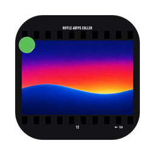

<p align="center"></p>

<p align="center">English | <a href="./README.ja.md">日本語</a></p>

# Riffle

A culling app for going through the RAW files you shot, fast, and deciding what
to keep and what to throw away.

- It reads only the JPEG previews embedded in the RAW files, so paging through a
  folder of thousands of shots never keeps you waiting.
- Stars, picks / rejects and color labels are written to sidecar files that
  tools that read XMP sidecars, such as Lightroom, and DxO PhotoLab can read.
  The RAW files themselves are never written.
- There is no developing and no editing. It does one thing: choosing.

For the supported cameras and formats, see [Compatibility](#compatibility).

## Getting started

### Install

Download the file for your OS from the latest release on the
[Releases page](https://github.com/minodisk/riffle/releases):

| OS | File |
|----|------|
| macOS, Apple Silicon | `Riffle_<version>_aarch64.dmg` |
| macOS, Intel | `Riffle_<version>_x64.dmg` |
| Windows | `Riffle_<version>_x64-setup.exe` |
| Linux | `Riffle_<version>_amd64.AppImage` |

The app is not signed by the OS vendors, so the first launch needs your
permission once:

- **macOS**: right-click `Riffle.app` → Open.
- **Windows**: in the SmartScreen warning, More info → Run anyway.

After that, updates are downloaded automatically on launch and take effect the
next time Riffle starts. For the other packages and the details, see
[docs/usage.md](./docs/usage.md#installing).

### First steps

1. Choose your developing software (Lightroom, DxO PhotoLab, or both) in the
   dialog Riffle shows on its first launch; it can be changed later in
   Settings.
2. Drop a folder onto the window (or open one with `Cmd+O` / `Ctrl+O`).
3. Page through the shots with `←` `→`, give stars with `1`-`5` and reject with
   `x`.
4. When the focus is in doubt, press `z` for the 1:1 view and check the focus
   point.

Judgments are saved to the sidecars as you go, so there is nothing to save.
When you are done, they are picked up by tools that read XMP sidecars and by
DxO PhotoLab.

## Key features

- **Folder tree**: the left pane browses home and the mounted volumes; click
  a folder to open it. The click also gives the tree the keyboard: the
  arrows, `Home` / `End`, `Enter` and typing a name move through and open
  folders, with the culling keys off until `Escape`. Right-click a folder
  to reveal it in Finder / File Explorer / the file manager, copy its
  path or name, rename it with `Rename…`, or move its rejects to the Trash,
  with or without its subfolders; `Cmd+click` / `Ctrl+click` and
  `Shift+click` select several folders whose rejects the right-click then
  moves together; a slow second click on the
  open folder's name renames it too. The name is edited in place: `Enter`
  or a click away renames, `Escape` cancels, and the index, the ratings
  and the remembered position follow the folder, which reopens under its
  new name when it was the open one.
- **Filmstrip**: thumbnails run along the bottom; click one to show it.
  `Cmd+click` / `Ctrl+click` adds or removes one, `Shift+click` and
  `Shift+←` / `Shift+→` select a range, `Cmd+A` / `Ctrl+A` selects every
  file the filter shows, and every judgment applies to the whole selection.
  Right-click a file and choose `Rename…`, or click the shown file's name
  again after a moment, to rename it in place: `Enter` or a click away
  renames, `Escape` cancels, and its XMP and `.dop` sidecars and its
  ratings move with it.
  `Ctrl+Alt+ArrowDown` (`Alt+Cmd+ArrowDown` on macOS) hides the filmstrip,
  `…ArrowLeft` the folder tree, `…ArrowRight` the meta pane and `Tab` both
  side panes, to give the viewer more room (the first three are also check
  items in the `View` menu). The meta
  pane's `Maker note` group shows the Sony AF, drive, stabilization and
  picture settings.
- **1:1 focus check**: `z` shows the image at 1:1, centered on the focus point.
  Paging keeps the zoom.
- **Focus mark**: `f` draws the AF frame the camera used around a crosshair on
  its focus point when the camera records the frame, the crosshair alone when
  it records only a point, and nothing without an AF point or on manual-focus
  shots (see [What the camera records](./docs/cameras.md)). The mark is green
  for a focus candidate, where the eyes of the face nearest the AF point are
  likely in focus (a probability combining their sharpness and edge width);
  orange when a face is near the AF point but its eyes are likely not; and
  white when Riffle does not know (no AF point, manual focus, no face near the
  point, or not computed yet). The camera's face tracking no longer colors
  the mark. The cue is computed in a second pass right after the thumbnails,
  so the marks turn from white as it runs; the strip marks each candidate
  with a green face icon at the cell's bottom-left, the meta pane shows the
  probability as `AF eye in focus` (a percentage), and the filter menu's
  `AF eye` section (`Sharp` / `Soft` / `Unknown`) narrows the strip by the
  state. The mark also draws the faces
  Riffle detects near the AF point as a cyan box with a dot between the eyes,
  a moment after `f`, since the detection runs when the frame is shown.
- **Sharpness cue**: a bar beside each thumbnail shows which frame of a burst is
  sharpest, scored on the camera's eye-AF frame when the camera recorded face
  tracking, else around the AF point, else on the subject's eyes when the
  camera recorded no AF point and a face is found, else the sharpest region
  (see [What the camera records](./docs/cameras.md)).
- **Offline face detection**: faces and eyes are found by the bundled
  [YuNet](https://github.com/opencv/opencv_zoo/tree/main/models/face_detection_yunet)
  model (MIT license), run locally with no network access. The strip's
  candidate icon, also on the filter menu's `Sharp` item, is
  [Lucide](https://lucide.dev)'s `scan-face` (ISC license).
- **HDR PQ (HEIF) CR3 previews**: the HEVC previews of Canon CR3 files shot
  with HDR PQ on are decoded by the bundled
  [hpvcd](https://github.com/awxkee/hpvcd) (BSD-3-Clause OR Apache-2.0).
- **Bursts**: frames shot within 1 s of each other share a band and a
  count badge on the strip; `ArrowUp` / `ArrowDown` jump between bursts,
  `Alt+ArrowLeft` / `Alt+ArrowRight` step through the frames of one and stop at
  its ends, and `Shift+x` rejects the rest of one. Cameras that record no
  sub-second capture time are grouped by whole seconds (see
  [What the camera records](./docs/cameras.md)).
- **Compare**: `v` shows 2–4 selected shots together, or the current shot
  beside the sharpest frame in its burst. Click a frame to rate, pick or
  reject only that one.
- **Move Rejected to Trash**: right-click a folder in the folder tree and
  choose `Move Rejected to Trash…` to move its rejected shots to the Trash,
  even a folder you have not opened, or
  `Move Rejected to Trash, Including Subfolders…` to do it for a whole year
  folder at once, or select several
  folders with `Cmd+click` / `Ctrl+click` / `Shift+click` and right-click to
  do it for all of them together. A dialog lists the rejects per folder and
  the total space freed before anything moves. Nothing is deleted, and one
  `Edit > Undo` brings the whole move back with the judgments; a file with
  the same name at the original location, an emptied Trash or a file already
  restored by hand is reported and left as it is. `Edit > Redo` then moves
  what came back to the Trash again.
- **Sequence JPEG Timestamps**: after culling in Riffle and exporting the keepers
  as JPEGs from your RAW developer, right-click the export folder in the
  folder tree and choose `Sequence JPEG Timestamps…` to space the capture
  times of a burst one second apart, so Google
  Photos, which ignores sub-second times, keeps the frames in shooting order.
  Files are ordered by capture time, then sub-second time, then file name, so a
  folder exported from two bodies interleaves correctly. A preview shows the
  new times first. The result is a complete copy in `<folder>-sequenced/` next
  to the export folder, which is shown in your file manager when the run ends;
  the originals are never touched, and running it again rebuilds the copy from
  the original times.
- **JPEG-only folders**: a folder that holds only JPEGs, such as a
  `<folder>-sequenced/` output, opens view-only, so its order and capture
  times can be checked in Riffle: thumbnails, the preview and the EXIF rows,
  in capture-time order. Stars, flags, color labels, sidecars and the focus
  cue do not apply there.
- **MCP companion**: an MCP client, such as an AI assistant, can follow along
  while you cull: read what Riffle shows, look at a preview, move the view and
  record stars, picks / rejects and labels the way the keys do. It is off by
  default, listens on this computer only and cannot move anything to the
  Trash (see [MCP companion](#mcp-companion)).

Every feature, and the full key reference, is described in
[docs/usage.md](./docs/usage.md) ([Keys](./docs/usage.md#keys)).

## Working with other software

Judgments are saved in a sidecar file next to the RAW. The format is chosen on
the first launch and can be changed in the settings:

- **Lightroom (XMP)**: `FOO.ARW` gets `FOO.xmp`, the format Lightroom
  and others read. Picks and rejects are written as `xmpDM:good` and color
  labels as both `photoshop:LabelColor` and `xmp:Label`, the way Lightroom
  writes them. The name written to `xmp:Label` can be set per color in the
  settings.
- **PhotoLab (.dop)**: `FOO.ARW` gets `FOO.ARW.dop`, which holds picks and rejects too.
- **Both**: every judgment goes to `FOO.xmp` and `FOO.ARW.dop` alike, for
  developing in Lightroom and PhotoLab from one culling pass. When a folder
  opens, whichever of the two was modified last is read back, so a later
  edit in either tool is picked up. Switching to Both rewrites nothing: a
  file's two sidecars can disagree until it is judged again.

A sidecar created by other software is edited in place: everything except the
stars, the flag and the label (develop settings, keywords, ...) is left
untouched.

Two RAWs of the same stem with different extensions in one folder (`FOO.ARW`
and `FOO.DNG`) share `FOO.xmp` and are not supported: renaming one of them or
moving it to the Trash takes the shared `FOO.xmp` with it, and the other's
judgment along. Use the PhotoLab (.dop) format alone from the start, which writes one
`FOO.ARW.dop` per RAW, with no `FOO.xmp` in the folder (**Both** writes the
shared `FOO.xmp` too, and Riffle moves an existing `FOO.xmp` along whichever
format is chosen), or keep such RAWs in separate folders.

### Lightroom

- Lightroom (not Classic) reads the XMP Riffle wrote when the photos are
  imported.
- A rating, flag or color label changed in Lightroom is written back to the
  `.xmp` next to the RAW by Lightroom itself; unlike Lightroom Classic, no
  `Ctrl+S` or auto-write setting is needed. Riffle picks the change up when
  the folder is opened.
- Verified with Lightroom 9.5.1 on Windows.

### Lightroom Classic

- Lightroom Classic reads the XMP Riffle wrote when the photos are first
  imported.
- After import it does not re-read a sidecar Riffle changed, not even on
  restart. For the selected photos, right-click them in the Library grid and
  choose `Metadata > Read Metadata from File`. For a whole folder, right-click
  the folder, choose `Synchronize Folder...`, check
  `Scan for metadata updates` and click `Synchronize`.
- Lightroom Classic does not write XMP by default. `Ctrl+S`
  (`Metadata > Save Metadata to File`) writes it for the selected photos, or
  turn on `Catalog Settings > Metadata > Automatically write changes into XMP`.
- Color labels are matched by name against Lightroom Classic's color label
  set (`Metadata > Color Label Set > Edit...`). Either rename that set's labels
  to `Red`, `Yellow`, `Green`, `Blue` and `Purple`, or set Riffle's label names
  in the settings to the names in the set. Presets for Lightroom's localized
  default sets are provided (English and Japanese so far); adding a language
  is [one JSON file](./crates/core/i18n/README.md).

### DxO PhotoLab

- PhotoLab recognizes an image by the identifiers in its `.dop`. Once
  PhotoLab has seen an image (opening its folder is enough, even if no `.dop`
  was written), a new `.dop` with identifiers it does not know is imported as
  a virtual copy that carries Riffle's judgment, while the master keeps its
  own.
- So on Windows, when Riffle creates a `.dop`, it reads the image's
  identifiers from PhotoLab's database (the newest
  `%APPDATA%\DxO\DxO PhotoLab N\Database\PhotoLab.db`) and writes them
  into it, and PhotoLab applies the judgment to the master.
- When the database is not found (on macOS, or without PhotoLab installed)
  the new `.dop` still works: PhotoLab imports it as the master, unless it
  had already seen the image, in which case the judgment lands on a virtual
  copy.
- A `.dop` that already exists is edited in place as before.
- Verified with PhotoLab 10.0.1 on Windows.

### MCP companion

Riffle can serve an [MCP](https://modelcontextprotocol.io/) endpoint for an
MCP client (an AI assistant, say) to sit beside you while you cull. Turn on
`Let MCP clients connect` in the `MCP` tab of the settings (it is off by
default); the server then listens on this computer only, at:

```text
http://127.0.0.1:41917/mcp
```

That URL is all a client that speaks MCP over Streamable HTTP needs. Two
examples:

- **Claude Code**:
  `claude mcp add --transport http riffle http://127.0.0.1:41917/mcp`
- **Claude Desktop**: add this to `claude_desktop_config.json`. It relays
  through `npx -y mcp-remote`, so it needs Node.js; a direct `url` entry has
  not been verified.

  ```json
  {
    "mcpServers": {
      "riffle": {
        "command": "npx",
        "args": ["-y", "mcp-remote", "http://127.0.0.1:41917/mcp"]
      }
    }
  }
  ```

The `MCP` tab shows the URL and these examples with Copy buttons. What the
tools do is described in [docs/usage.md](./docs/usage.md#mcp-companion).

## Compatibility

Anything unchecked has not been verified yet. Reports of how it went for you
are very welcome.

### OS

- macOS (Apple Silicon)
  - [x] 26
- Windows
  - [x] 11
- Linux
  - [x] Ubuntu

If it works, post in the
[OS works report thread](https://github.com/minodisk/riffle/discussions/286) in
Discussions. If it does not, open an issue from the
[OS issue template](https://github.com/minodisk/riffle/issues/new?template=os.yml).

### RAW formats and cameras

- ARW
  - [x] Sony α1
  - [x] Sony α9 III
  - [x] Sony α7 V
  - [x] Sony α7 IV
  - [x] Sony α7R V
  - [x] Sony α7S III
  - [x] Sony α7C II
  - [x] Sony α7CR
  - [x] Sony α6700
  - [x] Sony ZV-E1
- CR3
  - [x] Canon EOS R
  - [x] Canon EOS RP
  - [x] Canon EOS R3
  - [x] Canon EOS R5
  - [x] Canon EOS R5 Mark II
  - [x] Canon EOS R6
  - [x] Canon EOS R6 Mark II
  - [x] Canon EOS R6 Mark III
  - [x] Canon EOS R7
  - [x] Canon EOS R10
  - [x] Canon EOS R50
  - [x] Canon EOS R50 V
  - [x] Canon EOS R100
- DNG
  - [x] Leica M11-P
  - [x] SIGMA BF
  - [x] SIGMA fp L
- NEF
  - [x] Nikon Z 9
  - [x] Nikon Z 8
  - [x] Nikon Z 7II
  - [x] Nikon Z 6II
  - [x] Nikon Z 6
  - [x] Nikon Z 5
  - [x] Nikon Z f
  - [x] Nikon Z fc
  - [x] Nikon Z 50
  - [x] Nikon Z 30
  - [x] Nikon D850
  - [x] Nikon D500
- ORF
  - [x] OM System OM-1
  - [x] OM System OM-1 Mark II
  - [x] OM System OM-3
  - [x] OM System OM-5
  - [x] OM System OM-5 Mark II
  - [x] Olympus E-M1X
  - [x] Olympus E-M1 Mark III
  - [x] Olympus E-M1 Mark II
  - [x] Olympus E-M5 Mark III
  - [x] Olympus E-M10 Mark IV
  - [x] Olympus PEN E-P7
  - [x] Olympus PEN-F
- RAF
  - [x] Fujifilm X-H2S
  - [x] Fujifilm X-H2
  - [x] Fujifilm X-T5
  - [x] Fujifilm X-T50
  - [x] Fujifilm X-T4
  - [x] Fujifilm X-T3
  - [x] Fujifilm X-T30 III
  - [x] Fujifilm X-T30 II
  - [x] Fujifilm X-S20
  - [x] Fujifilm X-S10
  - [x] Fujifilm X-M5
  - [x] Fujifilm X-E5
  - [x] Fujifilm X-E4
  - [x] Fujifilm X-Pro3
  - [x] Fujifilm X100VI
  - [x] Fujifilm X100V
  - [x] Fujifilm GFX100 II
  - [x] Fujifilm GFX100S II
  - [x] Fujifilm GFX100S
  - [x] Fujifilm GFX100RF
  - [x] Fujifilm GFX 100
  - [x] Fujifilm GFX50S II

CR3 files shot with HDR PQ on (HEIF) hold no JPEG preview, so their preview
cannot be shown yet: the strip and the viewer say so, while the meta pane
still shows their EXIF rows.

A RAF holds one embedded JPEG, 4416x2944 on the X bodies and 4000x3000 on
the GFX bodies, below the sensor's resolution. The 1:1 view on RAF shows that
JPEG at its own size, not the sensor's pixels.

An ORF holds one embedded JPEG, 3200x2400 on every listed body, below the
sensor's resolution. The 1:1 view on ORF shows that JPEG at its own size, not
the sensor's pixels.

A folder that holds only JPEGs (`.jpg` / `.jpeg`) and no RAW file opens
view-only: thumbnails, the preview and the EXIF rows, in capture-time order,
with no stars, flags, color labels, sidecars or focus cue.

What each camera records, and which features that affects, is listed in
[docs/cameras.md](./docs/cameras.md). Why support is listed per camera rather
than per format is explained in [docs/raw-formats.md](./docs/raw-formats.md).

If a camera not on the list works, post in the
[camera works report thread](https://github.com/minodisk/riffle/discussions/287)
in Discussions. If it does not, open an issue from the
[camera issue template](https://github.com/minodisk/riffle/issues/new?template=camera.yml).
A sample file is needed to look into it, so please attach one (or link to it).
One file is enough; a landscape and a portrait shot, if possible, also let the
rotation and the focus mark be checked.

### Sidecar formats and software

- XMP
  - [x] Adobe Lightroom
  - [x] Adobe Lightroom Classic
- DOP
  - [x] DxO PhotoLab

If the stars, flags and color labels given in Riffle show up correctly in the
software, post in the
[software works report thread](https://github.com/minodisk/riffle/discussions/288)
in Discussions. If they do not, open an issue from the
[software issue template](https://github.com/minodisk/riffle/issues/new?template=software.yml).

## For developers

- Building from source: [CONTRIBUTING.md](./CONTRIBUTING.md)
- Performance measurements: [docs/performance.md](./docs/performance.md)
