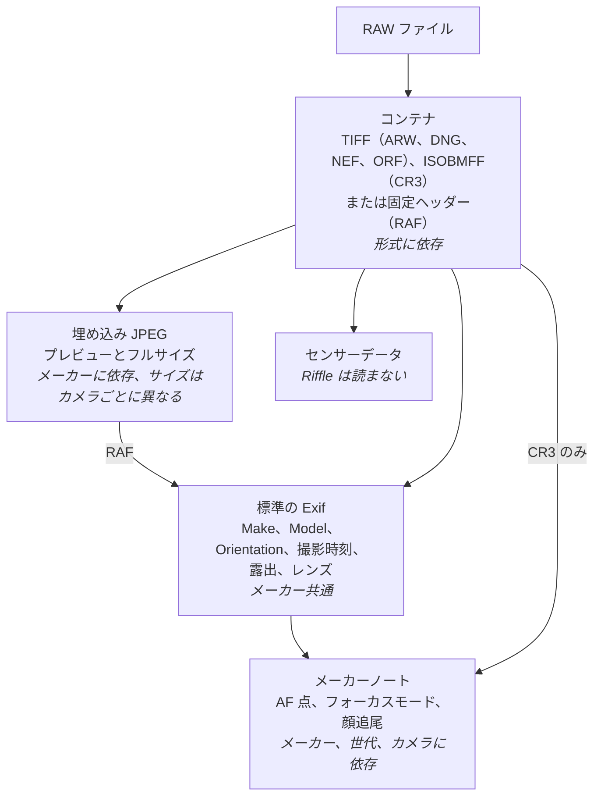
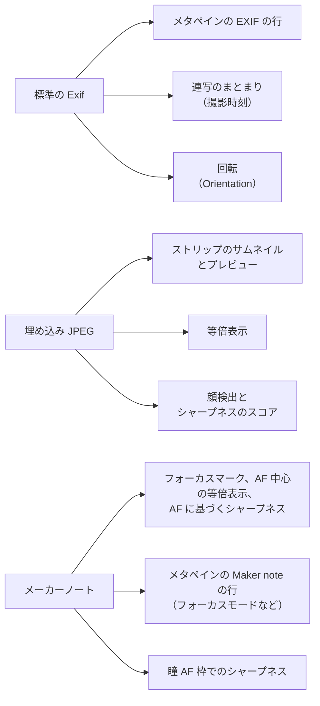

<a href="./raw-formats.md">English</a> | 日本語

# RAW ファイルはどう違うのか、対応状況をカメラごとに載せている理由

RAW ファイルは 1 つの形式ではありません。標準の Exif、カメラが描画した 1 つ以上の JPEG、センサーデータ、メーカー独自のメーカーノートを収めたコンテナです。それぞれの層が依存するものは異なります。コンテナはファイル形式に、Exif はどれにも依存せず（共通です）、JPEG はメーカーに、メーカーノートはメーカー、世代、そして多くの場合カメラに依存します。このページでは、Riffle が読む形式（ARW、DNG、NEF、CR3、RAF、ORF）についてそれらの層と、各機能がどの層を使うか、そしてカメラの一覧が形式ではなくカメラの名前を挙げている理由を説明します。その一覧と、確認した各カメラが記録する情報は[カメラが記録する情報](./cameras.ja.md)にあります。

## 層の構造

| 層 | 依存するもの | 異なる点 |
|---|---|---|
| コンテナ | 形式 | TIFF の IFD（リトルエンディアンまたはビッグエンディアン、ORF では非標準のヘッダー）、ISOBMFF のボックス、または RAF ヘッダーの固定オフセット |
| 標準の Exif | なし: どのメーカーも同じタグを書き込む | カメラが 1 秒未満の撮影時刻を記録するかどうか |
| 埋め込み JPEG | メーカー | JPEG の置き場所、数、サイズ。サイズはカメラごとに変わる |
| メーカーノート | メーカー、世代、カメラ | ヘッダー、オフセット、どのタグがあるか、バージョンごとのレイアウト。ARW、DNG、NEF、ORF では Exif IFD のタグ 0x927c（ORF ではプレビュー JPEG も収める）、RAF では埋め込み JPEG の Exif IFD の中、CR3 では専用の `CMT3` ボックス |

## 各機能で Riffle が読むもの

Riffle はセンサーデータを一切デコードしません。表示するものはすべて埋め込み JPEG から、写真について知ることはすべて Exif から得ます。AF 点、フォーカスモード、瞳 AF 枠だけはメーカーノートから得ます。

| 機能 | コンテナ | Exif | 埋め込み JPEG | メーカーノート |
|---|---|---|---|---|
| サムネイルとプレビュー | ✓ | Orientation | プレビュー JPEG | – |
| 等倍表示 | ✓ | Orientation | フルサイズ JPEG | – |
| メタペインの EXIF の行 | ✓ | ✓ | – | – |
| メタペインの Maker note の行（フォーカスモードなど） | ✓ | – | – | ✓ |
| 連写 | ✓ | 撮影時刻、1 秒未満の時刻 | – | – |
| フォーカスマークと AF に基づくシャープネス | ✓ | – | ✓ | AF 点 |
| 瞳 AF 枠でのシャープネス（Sony） | ✓ | – | ✓ | AF 追尾枠 |

つまり、Riffle がコンテナを読めるカメラなら、プレビュー、等倍表示、EXIF の行、連写が使えます。AF 点にはメーカーノートのデコードも必要です。それがなければフォーカスマークは表示されず、シャープネスは検出した顔の目か、最もシャープな領域で測ります（[カメラが記録する情報](./cameras.ja.md)を参照）。

## 6 つの形式の違い

| | ARW（Sony） | DNG（Leica、SIGMA など） | NEF（Nikon） | CR3（Canon） | RAF（Fujifilm） | ORF（OM System、Olympus） |
|---|---|---|---|---|---|---|
| コンテナ | リトルエンディアンの TIFF | リトルエンディアンの TIFF | TIFF。最近のカメラはリトルエンディアン、古いカメラはビッグエンディアン | ISOBMFF（MP4 のボックス構造） | オフセットを並べた固定の `FUJIFILMCCD-RAW` ヘッダー、続いて JPEG とセンサーデータ | マジックナンバー 42 の代わりに非標準の `IIRO` ヘッダーを持つリトルエンディアンの TIFF |
| Exif | IFD0 と Exif IFD | IFD0 と Exif IFD | IFD0 と Exif IFD | ボックスに入った 2 つの TIFF: `CMT1`（IFD0）と `CMT2`（Exif IFD） | 埋め込み JPEG の中（IFD0 と Exif IFD） | IFD0 と Exif IFD |
| メーカーノート | Exif IFD のタグ 0x927c | Exif IFD のタグ 0x927c | Exif IFD のタグ 0x927c | 専用の `CMT3` ボックス | 埋め込み JPEG の Exif IFD のタグ 0x927c。`FUJIFILM` ヘッダーを持ち、オフセットはノートからの相対値 | Exif IFD のタグ 0x927c。`OLYMPUS` または `OM SYSTEM` ヘッダーを持ち、オフセットはノートからの相対値 |
| プレビュー JPEG | IFD0 の JPEG（α7 V では 1616x1080） | 順序の決まっていない JPEG ストリップのうち、幅が 1600 px 以上で最も小さいもの | 最後の JPEG SubIFD（1620x1080） | `PRVW` ボックス（1620x1080） | 唯一の埋め込み JPEG（最近の X シリーズでは 4416x2944、GFX シリーズでは 4000x3000、古い X シリーズでは 1920x1280 または 2048x1536、FinePix シリーズでは最大 2176x1448） | メーカーノートの中にあり、その CameraSettings IFD が指す（3200x2400） |
| フルサイズ JPEG | ほかの IFD のうち最も大きい JPEG。それより大きいものが埋め込まれていなければプレビュー | 最も大きい JPEG ストリップ | 最初の JPEG SubIFD | ムービー構造の JPEG トラック | 同じ JPEG。センサーの解像度より小さい | なし: プレビューが等倍表示を兼ねる |
| Riffle が読む AF 点 | Sony のメーカーノートの `FocusLocation` | SIGMA BF のメーカーノートのみ | Nikon のメーカーノートの `AFInfo2`（Z シリーズ） | Canon のメーカーノートの `AFInfo2`（EOS シリーズ） | Fujifilm のメーカーノートの `FocusPixel` | 読まない |

### ARW: 古いカメラにはフルサイズ JPEG がない

最近の Sony のカメラ（α1、α9 III、α7 IV、α7R V、α7S III、α7C II、α7CR、α6700、ZV-E1 のサンプル）は、IFD0 に 1616x1080 のプレビュー、IFD1 に 160x120 のサムネイル、IFD2 にフルサイズ JPEG を書き込みます。古いカメラ（α9 II、α7R IV、α7R IVA、α7C、α6400、α6600、ZV-E10 のサンプル）は IFD2 を書き込まないので、プレビュー以外で最も大きい JPEG は 160x120 のサムネイルになります。Riffle はプレビューより小さい JPEG を使わず、プレビューを等倍表示に使うので、これらのカメラの等倍表示は 1616x1080 のプレビュー（ZV-E10 は 1920x1080）を元のサイズで表示します。これらのカメラは対応機種に載せています。

### NEF: サムネイル以外に 2 つの JPEG があり、順序で見分ける

NEF には、一部のカメラでは IFD0 に 160x120 のサムネイル、Nikon のメーカーノートの中に小さなプレビュー（640x424、古いカメラでは 570x375）、そして SubIFD に JPEG が入っています。2012 年ごろ以降のカメラ（D800、Df 以降と、すべての Z シリーズ）は 2 つの JPEG SubIFD を書き込みます。先にフルサイズのもの、その後に 1620x1080 のもの（D800 では 1632x1080）です。サムネイルとメーカーノートのプレビューはプレビューペインには小さすぎるので、Riffle は後のほうをプレビューとして使います。SubIFD の JPEG は幅を持たず、フルサイズ JPEG のほうが 1620x1080 のものよりバイト数が小さいこともあるので、順序だけが両者を見分ける手がかりです。それより古いカメラは JPEG SubIFD を 1 つだけ書き込み、それがプレビューと等倍表示を兼ねます。

### CR3: IFD の代わりにボックス、そして HEIF ファイル

CR3 は MP4 と同じくボックスの並びです。Exif の TIFF は `moov` の中の Canon のボックスに、1620x1080 のプレビューはその後ろのトップレベルの `uuid` ボックスの中の `PRVW` ボックスにあり、フルサイズ JPEG はムービー構造の最初のトラックで、センサーデータを収めたトラックと並んでいます。HDR PQ をオンにすると、カメラは HEIF を書き込みます。`PRVW` のプレビュー、サムネイル、その最初のトラックには、JPEG の代わりに HEVC の画像が入ります。Riffle は HEVC のプレビューとサムネイルをデコードして sRGB にトーンマッピングします。フルサイズの HEVC 画像はデコードしないので、こうしたファイルの等倍表示は 1620x1080 のプレビューを切り出したものになります。

### RAF: Exif は埋め込み JPEG の中にある

RAF は固定ヘッダーで始まります。`FUJIFILMCCD-RAW` のマジック、カメラのモデル、そして後に続くもののビッグエンディアンのオフセットと長さです。そのうちの 1 組が、ヘッダーのすぐ後にある埋め込み JPEG を指します。ファイル自体は Exif を持たず、Make、Model、Orientation、撮影時刻、露出、Fujifilm のメーカーノートはすべてその JPEG の Exif セグメントにあり、確認したどのカメラでもファイルの先頭 1 MiB に十分収まって終わります。この JPEG はファイルの中で唯一のものなので、プレビューと等倍表示を兼ねます。最近の X シリーズ（X-T3 と X-T30 以降）では 4416x2944、GFX シリーズでは 4000x3000 で、センサーの解像度（たとえば X-T5 では 7728x5152、GFX100 II では 11648x8736）より小さいので、RAF の等倍表示はセンサーの画素ではなくその JPEG を表示します。古い X シリーズでは 1920x1280（小型センサーのコンパクトカメラでは 2048x1536）、FinePix シリーズでは最大 2176x1448 なので、等倍表示は小さなプレビューにすぎません。カメラごとのサイズは[カメラが記録する情報](./cameras.ja.md)を参照してください。

### ORF: プレビューはメーカーノートの中にある

ORF は、ヘッダーにマジックナンバー 42 の代わりに `IIRO`（一部の古いカメラでは `MMOR` または `IIRS`）を持つ TIFF で、Exif は通常どおり IFD0 と Exif IFD にあります。IFD0 はセンサーデータだけを指し、ファイル中で唯一の JPEG はメーカーノートの中にあって、その CameraSettings IFD の `PreviewImageStart` と `PreviewImageLength` タグで位置がわかります。ノートは `OLYMPUS` ヘッダー（Olympus のカメラ）または `OM SYSTEM` ヘッダー（OM System のカメラ）で始まり、プレビューのものも含めて中のすべてのオフセットは、TIFF ヘッダーからではなくノートの先頭から数えます。プレビューを中に含むためノートは 1.5〜1.8 MB ほどになりますが、IFD は先頭にあるので、メタデータは最初の 1 MB から読み、プレビューはそれを超えて終わる場合に範囲を指定した 1 回の読み込みで取得します。JPEG は確認したどのカメラでも 3200x2400 で、センサーの解像度より小さく、プレビューと等倍表示を兼ねます。

## メーカーノートがカメラごとに異なる理由

メーカーノートには標準のレイアウトがありません。各メーカーが独自に定義し、世代の間で、さらにはカメラの間でも変えています。

- **Sony**: TIFF 形式の IFD で、古いカメラには `SONY` ヘッダーがあり、最近のカメラにはありません。世代の間で場所が変わるタグもあり、Riffle が読むフォーカスモードは、最近のカメラではあるタグに、古いカメラでは別のタグにあります。
- **SIGMA**: DNG を書き込む 2 機種で違いがあります。BF はメーカーノートに AF 点を記録し、fp L は何も記録しません。`Make` の文字列さえ綴りが異なります（BF は `Sigma`、fp L は `SIGMA`）。
- **Leica**: `LEICA` ヘッダーの後に IFD が続きます。M11-P は AF 点を記録しません。
- **Nikon**: `Nikon` ヘッダーの後に、まるごと 1 つの独自の TIFF が続きます。AF データ（`AFInfo2`）はバージョン番号で始まり、バージョンごとにフィールドの配置が異なります。Z シリーズは `03xx` または `04xx` を書き込み、AF エリアの位置を左上からのピクセルで持ちますが、D850 などの一眼レフは `0101` を書き込み、代わりにグリッドの点を名前で示します。
- **Canon**: AF データは世代によって `AFInfo`、`AFInfo2`、`AFInfo3` として書き込まれてきました。位置は画像の中心からの相対値で（EOS では Y が上向き、PowerShot では下向き）、AF 点の数はカメラごとに異なります。
- **Fujifilm**: `FUJIFILM` ヘッダーの後に IFD が続き、そのオフセットは TIFF ヘッダーからではなくノートの先頭から数えます。AF 点は埋め込み JPEG のピクセル上の点である `FocusPixel` として記録され、マニュアルフォーカスの写真でも記録されるので、Riffle はフォーカスモードも読んでそうした写真では AF 点を捨てます。
- **OM System / Olympus**: `OLYMPUS` または `OM SYSTEM` ヘッダーの後に IFD が続き、そのオフセットはノートの先頭から数えます。独自のバイトオーダーとサブ IFD（Equipment、CameraSettings、FocusInfo など）を持ちます。AF 点は CameraSettings の中に、OM のカメラでは `AFTargetInfo` として、また `AFPointSelected` としてあります。Riffle はまだ読みません。

コンテナと Exif はある形式のどのカメラでも同じですが、埋め込み JPEG のサイズと、何よりメーカーノートはそうではありません。新しいカメラはタグを移したり、新しいバージョンの `AFInfo2` を書き込んだり、デフォルトを HEIF に切り替えたりすることがあります。そのため[カメラが記録する情報](./cameras.ja.md)は、形式やメーカー全体の対応をうたうのではなく、実際のファイルで確認したカメラを 1 台ずつ載せています。そして、載っていないカメラはサンプルファイルを添えて報告してもらうことで追加していきます。
