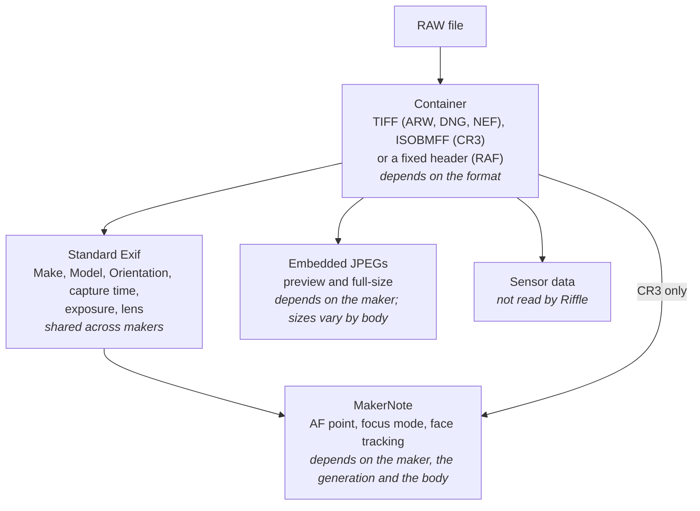
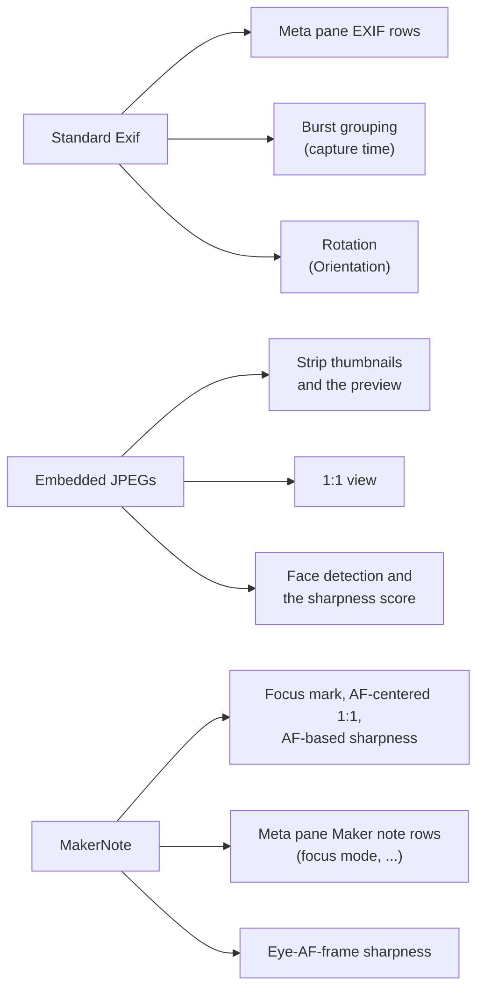

# How RAW files differ, and why support is listed per camera

A RAW file is not one format. It is a container holding standard Exif, one or
more JPEGs the camera rendered, the sensor data, and a maker-specific
MakerNote. Each layer depends on something different: the container on the
file format, Exif on nobody (it is shared), the JPEGs on the maker, and the
MakerNote on the maker, the generation and often the body. This page explains
those layers for the formats Riffle reads (ARW, DNG, NEF, CR3, RAF), which of them
each feature uses, and why the [Compatibility](../README.md#compatibility)
list names bodies rather than formats. What each tested body records is in
[What the camera records](./cameras.md).

## The layers

| Layer | Depends on | What varies |
|---|---|---|
| Container | The format | TIFF IFDs (little- or big-endian), ISOBMFF boxes, or the RAF header's fixed offsets |
| Standard Exif | Nothing: every maker writes the same tags | Whether a body records sub-second capture time |
| Embedded JPEGs | The maker | Where the JPEGs sit, how many there are, and their sizes, which change by body |
| MakerNote | The maker, the generation and the body | Its header, its offsets, which tags exist, and their layout per version. Exif IFD tag 0x927c on ARW, DNG and NEF, and in the embedded JPEG's Exif IFD on RAF; its own `CMT3` box on CR3 |

## What Riffle reads for each feature

Riffle never decodes the sensor data. Everything it shows comes from the
embedded JPEGs, and everything it knows about a shot comes from Exif and, for
the AF point, the focus mode and the eye-AF frame, the MakerNote.

| Feature | Container | Exif | Embedded JPEGs | MakerNote |
|---|---|---|---|---|
| Thumbnails and the preview | ✓ | Orientation | the preview JPEG | – |
| 1:1 view | ✓ | Orientation | the full-size JPEG | – |
| Meta pane EXIF rows | ✓ | ✓ | – | – |
| Meta pane Maker note rows (focus mode, ...) | ✓ | – | – | ✓ |
| Bursts | ✓ | capture time, sub-second | – | – |
| Focus mark and AF-based sharpness | ✓ | – | ✓ | the AF point |
| Eye-AF-frame sharpness (Sony) | ✓ | – | ✓ | the AF tracking frame |

So a body whose container Riffle reads gets the preview, the 1:1 view, the
EXIF rows and bursts. The AF point needs its MakerNote to be decoded as well;
without it, the focus mark is not drawn and sharpness falls back to the eyes
of a detected face or the sharpest region (see
[What the camera records](./cameras.md)).

## How the five formats differ

| | ARW (Sony) | DNG (Leica, SIGMA, ...) | NEF (Nikon) | CR3 (Canon) | RAF (Fujifilm) |
|---|---|---|---|---|---|
| Container | Little-endian TIFF | Little-endian TIFF | TIFF, little-endian on recent bodies, big-endian on older ones | ISOBMFF (the MP4 box structure) | A fixed `FUJIFILMCCD-RAW` header of offsets, then a JPEG and the sensor data |
| Exif | IFD0 and the Exif IFD | IFD0 and the Exif IFD | IFD0 and the Exif IFD | Two TIFFs in boxes: `CMT1` (IFD0) and `CMT2` (the Exif IFD) | Inside the embedded JPEG (IFD0 and the Exif IFD) |
| MakerNote | Exif IFD tag 0x927c | Exif IFD tag 0x927c | Exif IFD tag 0x927c | Its own `CMT3` box | Exif IFD tag 0x927c of the embedded JPEG, with a `FUJIFILM` header and offsets relative to the note |
| Preview JPEG | IFD0's JPEG (1616x1080 on the α7 V) | The smallest JPEG at least 1600 px wide, from the JPEG strips in no fixed order | The last JPEG SubIFD (1620x1080) | The `PRVW` box (1620x1080) | The one embedded JPEG (4416x2944 on the X bodies, 4000x3000 on the GFX bodies) |
| Full-size JPEG | The largest JPEG in the other IFDs | The largest JPEG strip | The first JPEG SubIFD | The JPEG track in the movie structure | The same JPEG, below the sensor's resolution |
| AF point read by Riffle | Sony MakerNote `FocusLocation` | SIGMA BF MakerNote only | Nikon MakerNote `AFInfo2` (Z bodies) | Canon MakerNote `AFInfo2` (EOS bodies) | Not read |

### ARW: no full-size JPEG on older bodies

Recent Sony bodies (the α1, α9 III, α7 IV, α7R V, α7S III, α7C II, α7CR,
α6700 and ZV-E1 samples) write a 1616x1080 preview in IFD0, a 160x120
thumbnail in IFD1 and the full-size JPEG in IFD2. Older bodies (the α9 II,
α7R IV, α7R IVA, α7C, α6400, α6600 and ZV-E10 samples) write no IFD2, so the
largest JPEG besides the preview is the 160x120 thumbnail. These files still
open, but Riffle takes that thumbnail as the full-size JPEG, so the 1:1 view
enlarges the 160x120 thumbnail and looks blurry. These bodies are not listed
as supported until that is fixed.

### NEF: two JPEGs besides the thumbnail, told apart by order

A NEF carries a 160x120 thumbnail in IFD0 on some bodies, a small preview
(640x424, or 570x375 on older bodies) inside the Nikon MakerNote, and JPEGs in
its SubIFDs. Bodies from about 2012 on (D800, Df and later, every Z body)
write two JPEG SubIFDs: the full-size one first and a 1620x1080 one after it
(1632x1080 on the D800).
Riffle takes the later one as the preview, since the thumbnail and the
MakerNote preview are too small for the preview pane. The SubIFD JPEGs carry
no width, and a full-size JPEG can be smaller in bytes than the 1620x1080
one, so only their order tells them apart. Bodies older than that write one
JPEG SubIFD, which then serves as both the preview and the 1:1 view.

### CR3: boxes instead of IFDs, and HEIF files

A CR3 is a sequence of boxes, like an MP4. The Exif TIFFs live in Canon boxes
inside `moov`, the 1620x1080 preview in a `PRVW` box in a top-level `uuid` box
after it, and the
full-size JPEG is the first track of the movie structure, next to the tracks
holding the sensor data. With HDR PQ turned on, the camera writes HEIF: the
`PRVW` preview, the thumbnail and that first track hold HEVC images instead of
JPEGs. Riffle has no HEVC decoder, so it cannot show those files yet.

### RAF: the Exif rides inside the embedded JPEG

A RAF starts with a fixed header: the `FUJIFILMCCD-RAW` magic, the camera
model, and big-endian offsets and lengths of what follows. One of those pairs
points at the embedded JPEG, which comes right after the header. The file has
no Exif of its own: Make, Model, Orientation, the capture time, the exposure
and the Fujifilm MakerNote all live in that JPEG's Exif segment, which ends
about 64 KB into the file on every tested body. The JPEG is the only one in the
file, so it serves as both the preview and the 1:1 view. It is 4416x2944 on
the X bodies and 4000x3000 on the GFX bodies, below the sensor's resolution
(for example 7728x5152 on the X-T5 or 11648x8736 on the GFX100 II), so the
1:1 view on RAF shows that JPEG rather than the sensor's pixels.

## Why the MakerNote varies by body

The MakerNote has no standard layout. Each maker defines its own, and changes
it between generations and even between bodies:

- **Sony**: a TIFF-style IFD, with a `SONY` header on older bodies and none
  on recent ones. Some tags move between generations: the focus mode Riffle
  reads is at one tag on recent bodies and at others on older ones.
- **SIGMA**: two bodies writing DNG differ. The BF records its AF point in
  its MakerNote; the fp L records none. Even the `Make` string is spelled
  differently (`Sigma` on the BF, `SIGMA` on the fp L).
- **Leica**: a `LEICA` header, then an IFD; the M11-P records no AF point.
- **Nikon**: a `Nikon` header followed by a whole TIFF of its own. The AF
  data (`AFInfo2`) starts with a version number, and each version lays its
  fields out differently: the Z bodies write `03xx` or `04xx` with the AF
  area's position in pixels from the top left, while DSLRs such as the D850
  write `0101`, which names a grid point instead.
- **Canon**: the AF data has been written as `AFInfo`, `AFInfo2` and
  `AFInfo3` over the generations, with positions relative to the image center
  (Y pointing up on EOS bodies, down on PowerShots) and per-body AF-point
  counts.
- **Fujifilm**: a `FUJIFILM` header, then an IFD whose offsets count from the
  start of the note rather than from a TIFF header. It records the AF point as
  `FocusPixel`, even for manual-focus shots; Riffle does not read it yet.

The container and Exif are the same for every body of a format, but the
embedded JPEG sizes and, above all, the MakerNote are not. A new body can move
a tag, write a new `AFInfo2` version, or switch its default to HEIF. That is
why the [Compatibility](../README.md#compatibility) list names each body
verified on a real file instead of claiming a whole format or maker, and why
a report of an unlisted body with a sample file is the way to add it.
